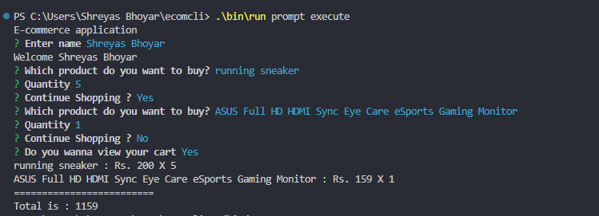

Ecom-CLI
=================

This application using the OCLIF and Inqurier libraries of Node.js to create an interactive CLI for an e-commerce website. The product listing is fetched from https://api.storerestapi.com/products

## Installation

Clone/Download this project and run the command given below in a terminal:

```bash
npm install
```

This command will install the required node files on your system.

## How to run this project locally

1. After installing the dependencies, run the following command:

   ```bash
    ./bin/run prompt execute
   ```

2. An interactive command line prompt would appear allowing you to interact with the application.
3. Enter your name
4. Select the product and enter quantity of the item
5. After selecting the product and quantity of the item, it would ask if you would like to continue for more products.
6. If you enter yes, the prompt would ask you to select the product and enter quantity of the item
7. Else, it would display an option to view cart.
8. After selecting View cart, it displays the amount and quantity of items in the cart and terminates execution

## `Sample Screenshots`


<div align="center">
     
</div>

<!-- commandsstop -->
